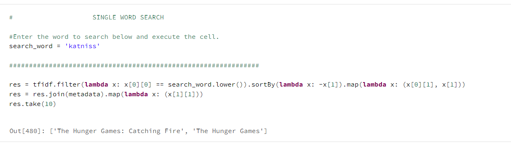
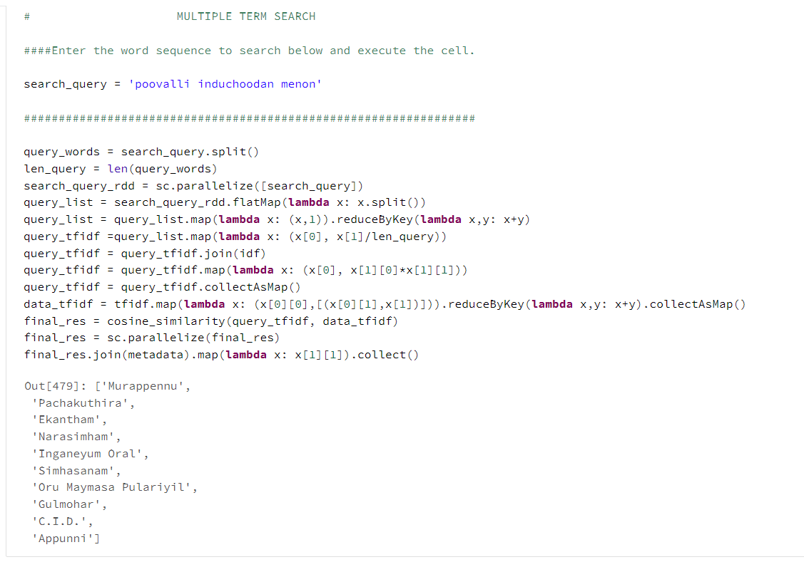

  **PysparkRDD**  
  1. Word count :  
  A simple word count application in pyspark using rdds. 
   
  2. PageRanking: 
  Pyspark MapReduce Page Ranking implementation for single term and multi-term search query.   
  Sample execution output :   
   
  

